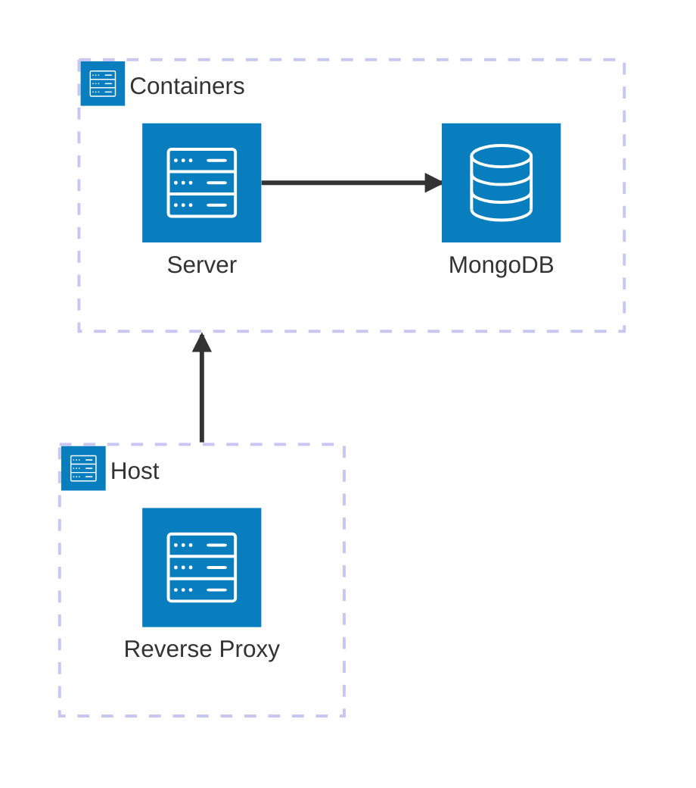
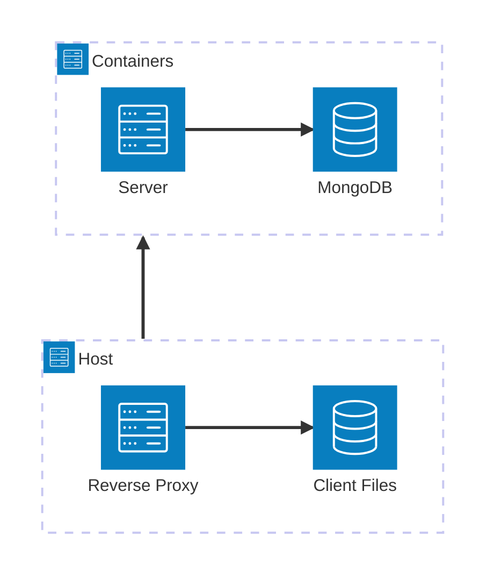

# Habitica Self-Hosted

Adaptions and infrastructure to facilitate self-hosting of the habit-building program [Habitica](https://habitica.com). It is based on the source code and assets of the [Habitica Repository](https://github.com/HabitRPG/habitica), hence the [LICENSE](https://github.com/HabitRPG/habitica/blob/develop/LICENSE) from there applies here and to the adaptions in this repository as well.


For each release in the Habitica upstream repository, the self-hosting adaptions are automatically applied by rebasing the `self-host` branch onto the last release commit. The Docker images for server and client are built then and pushed to Docker Hub as [awinterstein/habitica-server](https://hub.docker.com/r/awinterstein/habitica-server) and [awinterstein/habitica-client](https://hub.docker.com/r/awinterstein/habitica-client).

## Improvements for Self-Hosting

The following noteworthy changes were applied to the Habitica source code:

- Dockerfile and Github Workflow to create the production containers for hosting
- every user automatically gets a subscription on registration that never needs to be renewed
- locations for buying gems with money were replaced with options to buy with gold (e.g., the quick access in the header)
- group plans can be created without payment
- emails are sent directly via a configured SMTP server instead of using the Mailchimp (Mandrill) web-service
- settings and links (e.g., in the footer) that do not make sense for a self-hosted site were removed
- registrations can be restricted to only invited users via a configuration parameter
- analytics and payment scripts are not loaded

## Limitations

The following things do not work (yet):
- third-party access and scripts are not thoroughly disabled, so there might still be some scripts loaded

Contributions to fix those or other things are very welcome!

## Simple Setup with Docker Compose

Habitica needs a Mongo database, its server component (a NodeJS application) and its client component (a Vue.js application). In the simplest setup for self-hosting, there are two containers started for them, with a dependency from the server (that provides the server and the client component) to the database:



The server port could directly be exposed as port 80 on the host. However, usually a reverse proxy like Nginx would be put in front, that handles HTTPS traffic including TLS certificate handling.

The following Docker Compose file can be used for setting up the containers:

```yaml
version: "3"
services:
  server:
    image: docker.io/awinterstein/habitica-server:latest
    restart: unless-stopped
    depends_on:
      - mongo
    environment:
      - NODE_DB_URI=mongodb://mongo/habitica # this only needs to be adapted if using a separate database
      - BASE_URL=http://127.0.0.1:3000 # change this to the URL under which your instance will be reachable
      - INVITE_ONLY=false # change to `true` after registration of initial users, to restrict further registrations
      - EMAIL_SERVER_URL=mail.example.com
      - EMAIL_SERVER_PORT=587
      - EMAIL_SERVER_AUTH_USER=mail_user
      - EMAIL_SERVER_AUTH_PASSWORD=mail_password
    ports:
      - "3000:3000"
    networks:
      - habitica
  mongo:
    image: docker.io/mongo:latest # better to replace 'latest' with the concrete mongo version (e.g., the most recent one)
    restart: unless-stopped
    hostname: mongo
    command: ["--replSet", "rs", "--bind_ip_all", "--port", "27017"]
    healthcheck:
      test: echo "try { rs.status() } catch (err) { rs.initiate() }" | mongosh --port 27017 --quiet
      interval: 10s
      timeout: 30s
      start_period: 0s
      start_interval: 1s
      retries: 30
    volumes:
      - ./db:/data/db:rw
      - ./dbconf:/data/configdb
    networks:
      habitica:
        aliases:
          - mongo
networks:
  habitica:
    driver: bridge
```

> [!IMPORTANT]
> If you are planning to run the Habitica containers on a Raspberry Pi 4, you might not be able to use `mongo:latest` (see [issue 20](https://github.com/awinterstein/habitica/issues/20)). In this case you can try to use `mongo:bionic` instead.

## Optimized Setup with Docker Compose

As there's probably a web server running on the host already, acting as a reverse proxy for Habitica, this web server could be used to sever the static client files for Habitica as well.



Or the static client files could be served from a different host (e.g., a static file hosting).

## Readme of the Upstream Habitica Repository


[Habitica](https://habitica.com) is an open-source habit-building program that treats your life like a role-playing game. Level up as you succeed, lose HP as you fail, and earn Gold to buy weapons and armor!

**Want to contribute code to Habitica?** We're always looking for assistance on any issues in our repo with the "Help Wanted" label. The wiki pages below and the additional linked pages will tell you how to start contributing code and where you can seek further help or ask questions:
* [Guidance for Blacksmiths](https://habitica.fandom.com/wiki/Guidance_for_Blacksmiths) - an introduction to the technologies used and how the software is organized.
* [Setting up Habitica Locally](https://github.com/HabitRPG/habitica/wiki/Setting-Up-Habitica-for-Local-Development) - how to set up a local install of Habitica for development and testing.

**Interested in contributing to Habitica’s mobile apps?** Visit the links below for our mobile repositories.
* **Android:** https://github.com/HabitRPG/habitica-android
* **iOS:** https://github.com/HabitRPG/habitica-ios

Habitica's code is licensed as described at https://github.com/HabitRPG/habitica/blob/develop/LICENSE

**Found a bug?** Please report it to [admin email](mailto:admin@habitica.com) rather than create an issue (an admin will advise you if a new issue is necessary; usually it is not).

**Creating a third-party tool?** Please review our [API Usage Guidelines](https://github.com/HabitRPG/habitica/wiki/API-Usage-Guidelines) to ensure that your tool is compliant and maintains the best experience for Habitica players.

**Have any questions about Habitica or contributing?** See the links in the [Habitica](https://habitica.com) website's Help menu. There’s FAQ’s, guides, and the option to reach out to us with any further questions!
